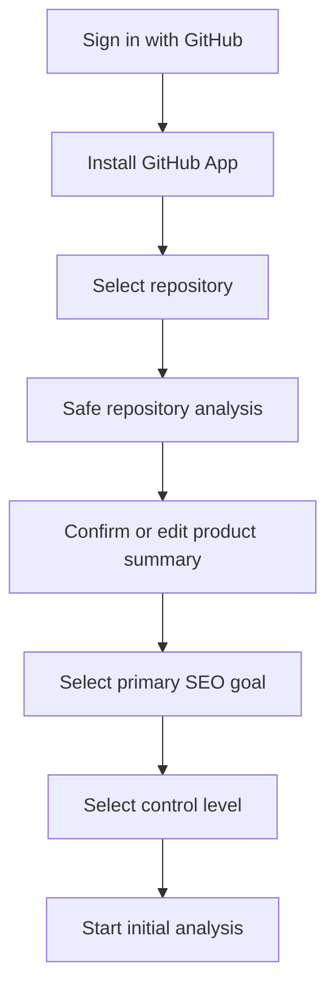
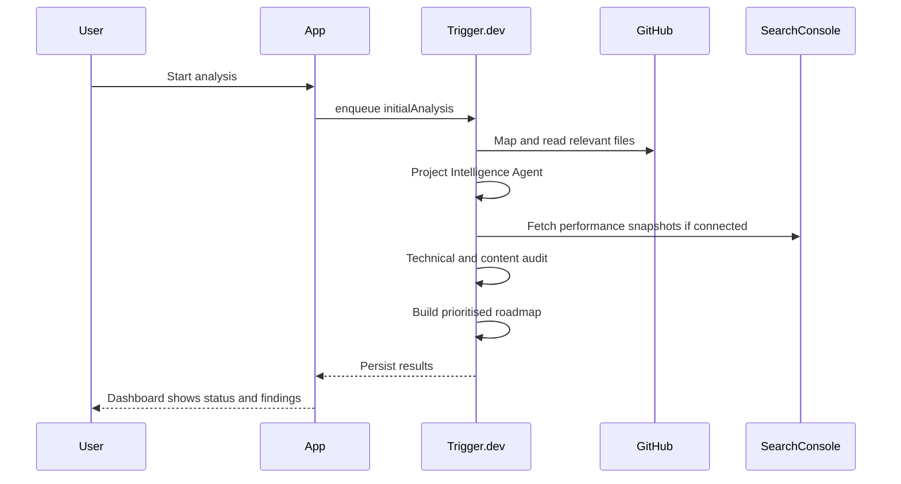
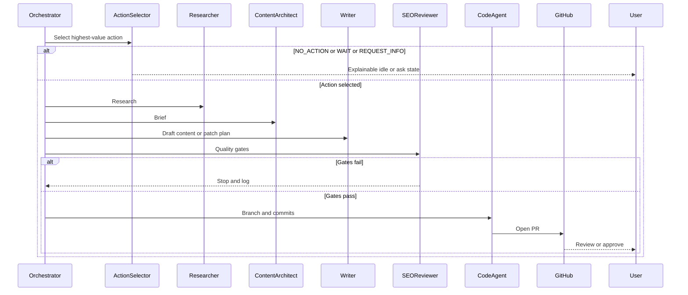

# User Flows

## 1. Onboarding (minimal decisions)

### Steps

1. **Connect GitHub** — OAuth sign-in; then GitHub App installation for repo access.
2. **Select repository** — List repos the installation can access; create a Project.
3. **Confirm product summary** — Show generated Project Intelligence Profile; allow edits to name, summary, audiences, conversion goals.
4. **Select primary SEO goal** — e.g. grow organic signups, support product education, technical SEO hygiene.
5. **Select control level** — review every change / one-click approve / auto-merge safe.
6. **Start initial analysis** — Enqueue audit + roadmap jobs; redirect to dashboard.

## 2. Initial analysis

Optional: GSC can be connected during or after onboarding. Without GSC, analysis proceeds with lower confidence and may select `WAIT_FOR_MORE_DATA` more often.

## 3. SEO action cycle

## 4. Email approval

1. PR ready → Resend email: what changed, why, expected benefit, file count/types, check status, Approve and Publish, Review Changes.
2. Approve link is signed, single-purpose, short-lived, auditable, replay-protected.
3. Before merge, revalidate: user auth, PR state, commit SHA, required checks, mergeability, subscription, publication policy.
4. On success: merge (if allowed), record audit log, consume reserved credits, notify user.

## 5. Auto-merge safe path

Eligible only when:

- Publication mode = auto-merge safe
- Action type is on the safe allowlist
- All quality gates and required checks pass
- Change does not touch protected / review-required paths
- Subscription active and credits available

Otherwise fall back to human review.

## 6. Billing upgrade

1. User hits credit or free-entitlement limit.
2. Dashboard shows upgrade CTA (no token meters).
3. Dodo checkout → webhook → activate plan + monthly SEO Action credits.
4. Portal for manage / cancel / payment method.

## 7. No-action / wait / request info

- **NO_ACTION** — Insufficient value or risk; show rationale; do not burn full research credits.
- **WAIT_FOR_MORE_DATA** — Need GSC maturity, more site authority signals, or prior action results.
- **REQUEST_PRODUCT_INFORMATION** — Blocked on unverified product claims; ask concise questions; resume when answered.

## Primary dashboard questions

At a glance the UI must answer:

1. What is the agent doing?
2. Why is it doing it?
3. What happened recently?
4. What requires my attention?
5. What measurable impact has been created?
