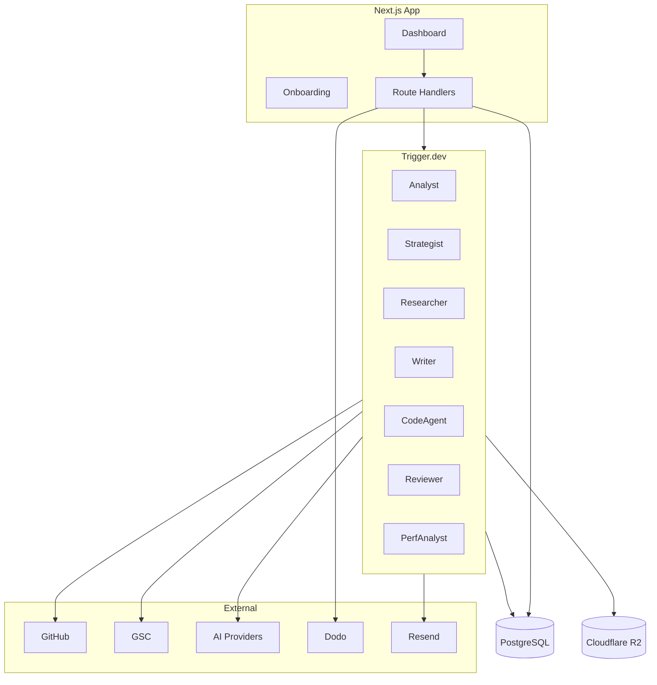

# System Architecture

## Style

Modular monolith. One Next.js application, clear feature modules, background orchestration via Trigger.dev. No premature microservices.

## High-level diagram

## Runtime boundaries

| Layer | Responsibility |
|---|---|
| UI (React) | Presentation, forms, status; no domain rules |
| Route handlers | Zod validation, authz, call module functions, format responses |
| Modules | Domain logic, persistence, policy |
| Trigger.dev tasks | Long AI, repo analysis, crawl, builds, multi-stage workflows |
| Lib | DB client, env, AI provider facade, crypto, GitHub/GSC clients |

**Rule:** Do not run long AI, repository analysis, crawling, or build operations inside a regular HTTP request. HTTP enqueues work and returns job/status handles.

## Modules

| Module | Owns |
|---|---|
| `auth` | Sessions, Better Auth wiring |
| `workspaces` | Workspace + membership |
| `projects` | Project config, goals, publication mode, cadence |
| `github` | App install, tokens, repo ops, PR helpers |
| `repo-analysis` | Directory map, selective reads, caches |
| `intelligence` | Project Intelligence Profile versions |
| `seo-strategy` | Audits, roadmaps, action selection orchestration |
| `keywords` | GSC-derived opportunities |
| `competitors` | Shallow competitor research cache |
| `content-planning` | Briefs, clusters |
| `content-generation` | Writer stage outputs |
| `technical-seo` | Metadata, sitemap, robots, schema checks |
| `pull-requests` | Branch/PR lifecycle, quality reports |
| `jobs` | Trigger.dev task registration and enqueue helpers |
| `search-console` | OAuth, snapshots |
| `billing` | Dodo, credits, entitlements |
| `notifications` | Resend + in-app |
| `audit-logs` | Immutable activity trail |

Avoid generic repository/service/manager/factory layers unless a second implementation exists.

## AI abstraction

Provider-independent facade over Vercel AI SDK:

- Route simple classification/scoring to low-cost models
- Route high-impact reasoning, final writing, complex code to strong models
- All agent I/O: structured JSON validated with Zod
- Persist: input, output, status, model, estimated/actual cost, duration, confidence, decision summary
- Never store raw chain-of-thought

## Data stores

- **PostgreSQL** — source of truth for app state
- **Cloudflare R2** — large artifacts (quality reports, optional repo snapshots, exports)
- **Caches in Postgres** — `cached_repo_summaries`, `competitor_research_cache`

## Deployment

- App: Vercel
- Jobs: Trigger.dev
- DB: managed PostgreSQL
- Observability: Sentry (errors), PostHog (product analytics)

## Extension posture

MVP hard-codes Next.js App Router + MD/MDX paths. Later frameworks add adapters behind `repo-analysis` / `content-generation` without introducing unused abstraction in MVP.
