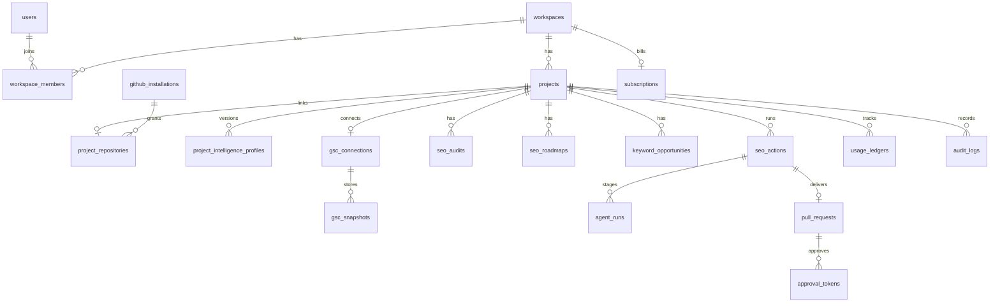

# Database Schema

Drizzle ORM + PostgreSQL. Auth tables follow Better Auth conventions; domain tables below.

## Entity overview

## Tables

### Auth (Better Auth)

- `user` — id, name, email, emailVerified, image, createdAt, updatedAt
- `session` — id, expiresAt, token, userId, ipAddress, userAgent
- `account` — provider accounts (GitHub OAuth)
- `verification` — email/verification tokens if used

### Workspaces and projects

**workspaces**

| Column | Type | Notes |
|---|---|---|
| id | uuid PK | |
| name | text | |
| slug | text unique | |
| created_at / updated_at | timestamptz | |

**workspace_members**

| Column | Type | Notes |
|---|---|---|
| id | uuid PK | |
| workspace_id | uuid FK | |
| user_id | uuid FK | |
| role | enum | `owner`, `member` |
| unique(workspace_id, user_id) | | |

**projects**

| Column | Type | Notes |
|---|---|---|
| id | uuid PK | |
| workspace_id | uuid FK | |
| name | text | |
| primary_seo_goal | text | |
| publication_mode | enum | `review_all`, `one_click`, `auto_safe` |
| status | enum | `onboarding`, `active`, `paused`, `error` |
| recommended_cadence | jsonb | nullable |
| default_branch | text | cached |
| created_at / updated_at | timestamptz | |

### GitHub

**github_installations**

| Column | Type | Notes |
|---|---|---|
| id | uuid PK | |
| workspace_id | uuid FK | |
| installation_id | bigint unique | GitHub installation id |
| account_login | text | |
| account_type | text | User/Organization |
| suspended_at | timestamptz | nullable |

**project_repositories**

| Column | Type | Notes |
|---|---|---|
| id | uuid PK | |
| project_id | uuid FK unique | |
| installation_id | uuid FK | |
| owner | text | |
| name | text | |
| full_name | text | |
| default_branch | text | |
| html_url | text | |

### Intelligence and GSC

**project_intelligence_profiles**

| Column | Type | Notes |
|---|---|---|
| id | uuid PK | |
| project_id | uuid FK | |
| version | int | monotonic per project |
| profile | jsonb | full structured profile |
| user_overrides | jsonb | nullable |
| confirmed_at | timestamptz | nullable |
| created_at | timestamptz | |

**gsc_connections**

| Column | Type | Notes |
|---|---|---|
| id | uuid PK | |
| project_id | uuid FK unique | |
| site_url | text | |
| refresh_token_encrypted | text | |
| scopes | text[] | |
| connected_at | timestamptz | |

**gsc_snapshots**

| Column | Type | Notes |
|---|---|---|
| id | uuid PK | |
| connection_id | uuid FK | |
| period_start / period_end | date | |
| query_rows | jsonb | |
| page_rows | jsonb | |
| fetched_at | timestamptz | |

### SEO domain

**seo_audits** — id, project_id, status, findings jsonb, created_at  
**seo_roadmaps** — id, project_id, items jsonb, generated_at  
**keyword_opportunities** — id, project_id, query, metrics jsonb, score, status  
**competitor_research_cache** — id, project_id, key, payload jsonb, expires_at  
**cached_repo_summaries** — id, project_id, commit_sha, summary jsonb, created_at

**seo_actions**

| Column | Type | Notes |
|---|---|---|
| id | uuid PK | |
| project_id | uuid FK | |
| action_type | text | enum-like |
| status | enum | queued, researching, briefing, executing, validating, awaiting_approval, merged, failed, skipped, cancelled |
| selection | jsonb | scores, evidence, rationale |
| brief | jsonb | nullable |
| credit_cost | int | |
| credits_reserved | boolean | |
| human_review_mandatory | boolean | |
| decision_summary | text | user-safe |
| created_at / updated_at | timestamptz | |

**agent_runs**

| Column | Type | Notes |
|---|---|---|
| id | uuid PK | |
| seo_action_id | uuid FK nullable | |
| project_id | uuid FK | |
| stage | text | analyst, strategist, researcher, … |
| status | enum | pending, running, succeeded, failed, aborted |
| input | jsonb | |
| output | jsonb | |
| decision_summary | text | |
| model | text | |
| estimated_cost_usd | numeric | |
| actual_cost_usd | numeric | |
| duration_ms | int | |
| confidence | numeric | |
| retry_reason | text | nullable |
| created_at | timestamptz | |

### PRs and approvals

**pull_requests**

| Column | Type | Notes |
|---|---|---|
| id | uuid PK | |
| seo_action_id | uuid FK | |
| project_id | uuid FK | |
| branch | text | |
| base_branch | text | |
| commit_sha | text | |
| pr_number | int | |
| pr_url | text | |
| quality_report | jsonb | |
| checks | jsonb | |
| merge_status | enum | open, merged, closed, failed |
| merged_at | timestamptz | nullable |

**approval_tokens**

| Column | Type | Notes |
|---|---|---|
| id | uuid PK | |
| pull_request_id | uuid FK | |
| token_hash | text unique | store hash only |
| purpose | text | `approve_and_publish` |
| expires_at | timestamptz | |
| used_at | timestamptz | nullable |
| used_by_user_id | uuid | nullable |

### Billing and audit

**subscriptions** — workspace_id, dodo_customer_id, dodo_subscription_id, plan, status, current_period_end  
**seo_action_credits** — workspace_id, balance, period_start, period_end  
**usage_ledgers** — workspace/project, kind, amount, seo_action_id, metadata, created_at  
**webhook_events** — provider, external_id unique, payload, processed_at (idempotency)  
**notifications** — user_id, channel, template, payload, sent_at  
**audit_logs** — workspace/project/user, action, entity_type, entity_id, summary, evidence jsonb, created_at

## Indexing notes

- `(project_id, created_at desc)` on seo_actions, agent_runs, audit_logs
- Unique `(project_id, version)` on intelligence profiles
- Unique webhook `(provider, external_id)`
- Unique approval `token_hash`
