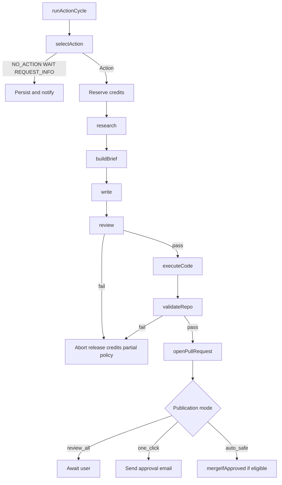

# Background Job Architecture

## Choice

**Trigger.dev** runs all long-running work: repository analysis, AI agent stages, builds, crawls, and multi-step SEO action orchestration.

HTTP request handlers only:

1. Validate and authorise
2. Persist intent
3. Enqueue a Trigger.dev task
4. Return job/action ids and status

## Task map

| Task | Trigger | Responsibility |
|---|---|---|
| `project.analyseRepository` | Onboarding / manual refresh | Directory map, selective reads, cache summary |
| `project.buildIntelligence` | After analysis | Project Intelligence Agent → profile version |
| `project.initialAudit` | After confirm + optional GSC | Technical/content/keyword/competitor audit |
| `project.buildRoadmap` | After audit | Prioritised roadmap |
| `seo.selectAction` | Cadence / manual run | Action selection agent |
| `seo.research` | After selection | Researcher stage |
| `seo.buildBrief` | After research | Content Architect |
| `seo.write` | After brief | Writer |
| `seo.review` | After write | SEO Reviewer + quality gates |
| `seo.executeCode` | After review pass | Code Agent: branch, commits |
| `seo.validateRepo` | After code | Lint/typecheck/build/content/SEO checks |
| `seo.openPullRequest` | After validate | PR + quality report |
| `seo.mergeIfApproved` | Approval / auto-safe | Revalidate and merge |
| `seo.monitorPerformance` | Scheduled | Performance Analyst + GSC deltas |
| `billing.processWebhook` | Dodo webhook | Idempotent subscription/credit updates |
| `notify.send` | Events | Resend + in-app notification records |

## Orchestration

Parent task `seo.runActionCycle(projectId)`:

## Retry policy

- Each stage is independently retryable
- Retries require an explicit `retry_reason` stored on `agent_runs`
- Cap retries per stage (default 2) to prevent generation loops
- Abort workflow when confidence or quality gates fail (not infinite retry)
- Idempotency keys: `(seo_action_id, stage, attempt)` where applicable

## Concurrency and limits

- Per-project: at most one active action cycle (queue others)
- Per-workspace: respect plan concurrency and credit balance
- Global rate limits for GitHub and GSC APIs

## Failure handling

- Persist failed stage output and error class (provider, validation, github, build)
- User-visible decision summary without internal stack traces
- Sentry capture for unexpected failures
- Do not partially push incomplete branches without marking action failed

## Scheduling

- Cadence recommendation drives soft schedule for `seo.runActionCycle`
- Performance monitor: daily/weekly GSC pull per connected project
- Never schedule mass publish when update/fix actions score higher

## Observability

Every task records: start/end, duration, related `seo_action_id` / `project_id`, cost fields for AI stages, outcome status.
