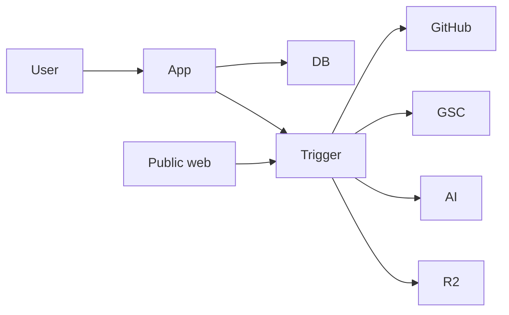

# Security Threat Model

## Assets

- GitHub installation tokens and OAuth credentials
- GSC refresh tokens
- Repository source (may contain secrets)
- User PII (email, names)
- Billing customer ids and webhook payloads
- Approval tokens
- Agent outputs and audit logs

## Threats and mitigations

| Threat | Impact | Mitigation |
|---|---|---|
| GitHub token abuse | Unwanted repo writes | Minimum permissions; never default branch; path policy; audit log |
| Prompt injection via repo/README | Malicious agent behaviour | Treat repo text as untrusted data; structured outputs; path allowlists; human review for risky changes |
| Secret exfiltration | Credential leak | Ignore secret paths; pre-commit secret scan; redact logs; never echo env |
| Approval link replay | Unauthorised merge | Hash tokens; single-use; short TTL; revalidate PR SHA and policy |
| Webhook spoofing (GitHub/Dodo) | Fake state changes | Signature verification; idempotent `webhook_events` |
| SSRF via crawl URLs | Internal network access | Allowlist public http(s); block private IPs/metadata endpoints |
| Cross-workspace access | Data leak | Authz on every project access; membership checks |
| Supply-chain via generated deps | Compromised build | Block autonomous dependency changes; review-required for package.json |
| Auto-merge of unsafe changes | Production damage | Safe allowlist; protected paths; mandatory review for structural/auth/API/config |
| Model over-sharing in emails | Sensitive disclosure | User-safe decision summaries only |
| Cost abuse / generation loops | Bill shock | Credits, per-project concurrency=1, retry caps, explicit retry reasons |

## Trust boundaries

- Repo content and crawled pages are **untrusted**
- User overrides on intelligence profile are **trusted preferences**, not proof of product capability
- AI output is **untrusted until quality gates pass**

## Cryptography

- Approval tokens: high-entropy random, store SHA-256 hash only, signed URL with purpose + expiry
- Encrypt GSC refresh tokens at rest (application-level encryption key)
- HTTPS everywhere

## Logging

- No secrets, tokens, or raw CoT in logs
- Audit log is append-oriented for user-visible decisions
- Sentry scrubbing for Authorization headers and env-like strings

## Incident response hooks

- Ability to pause a project / workspace (stops action cycles)
- Revoke GitHub installation
- Invalidate outstanding approval tokens for a PR
